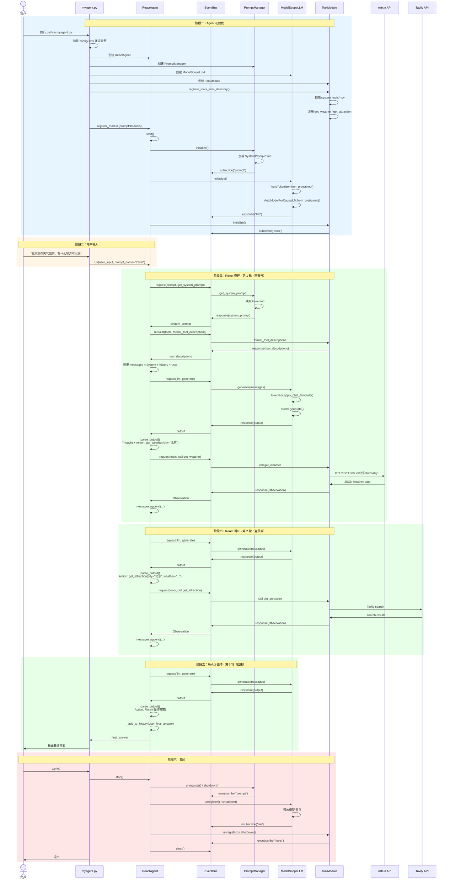
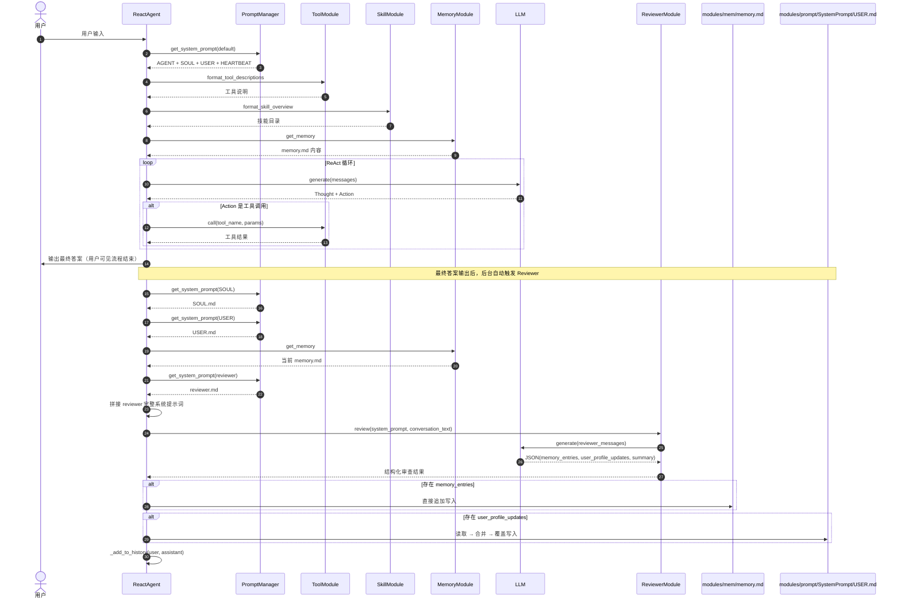

优化了模块结构，使用简单上下文机制，模块化运行成功

执行python myagent.py 后，目前的流程如下所示

```bash
==================================================
  Agent 正在初始化...
==================================================
  [✓] 模块 prompt 已初始化
[llm] 正在加载模型: ./Qwen/Qwen3-0.6B
Loading weights: 100%|████████████████████████████████████████████████| 311/311 [00:00<00:00, 689.18it/s]
[llm] 模型加载完成
  [✓] 模块 llm 已初始化
  [✓] 模块 tools 已初始化
==================================================
  Agent 初始化完成！
==================================================

============================================================
Agent 已启动，输入 'exit' 或 'quit' 退出
============================================================

你: 北京现在天气如何，有什么地方可以玩

用户输入: 北京现在天气如何，有什么地方可以玩
==================================================

--- 循环 1 ---

正在调用LLM...
模型输出:
Thought: 调用get_weather获取北京当前天气，然后根据返回结果使用get_attraction搜索景点推荐。
Action: get_weather(city="北京")

正在调用工具: get_weather({'city': '北京'})
Observation: 北京当前天气:附近有零星降雨，气温27摄氏度
==================================================
[{'role': 'system', 'content': '# 旅行助手\n\n你是一个智能旅行助手。你的任务是分析用户的请求，并使用可用工具一步步地解决问题。\n\n## 可用工具\n\n- `get_weather(city: str)`: 查询指定城市的实时天气信息。\n  - `city`: 城市名称，如 "北京"、"苏州"\n  - 示例：`get_weather(city="苏州")`\n  - 返回值：天气信息字符串，格式如 "苏州当前天气:晴，气温26摄氏度"。 如果查询失败，返回错误信息。\n\n- `get_attraction(city: str, weather: str)`: 根据城市名和天气情况，使用 Tavily Search API 搜索并返回优化后的景点推荐。 需要安装 tavily-python 并配置环境变量 TAVILY_API_KEY。\n  - `city`: 城市名称，如 "苏州"\n  - `weather`: 天气状况，如 "晴"、"雨天"\n  - 示例：`get_attraction(city="苏州", weather="晴")`\n  - 返回值：景点推荐文本； 若搜索失败，返回错误信息。\n\n## 输出格式要求\n\n你的每次回复必须严格遵循以下格式，包含一对Thought和Action：\n\nThought: [你的思考过程和下一步计划]\nAction: [你要执行的具体行动]\n\nAction的格式必须是以下之一：\n1. 调用工具：工具名(参数名="参数值") 。\n2. 结束任务：Finish[你的最终答案内容]。\n\n## 重要提示\n\n- 每次只输出一对Thought-Action，严格遵守输出格式要求！\n- 可用工具是以函数调用格式提供的，调用工具时必须严格按照函数调用格式进行。\n- Action必须在同一行，不要换行\n- 仅当收集到足够信息可以回答用户问题时，必须使用 Action: Finish[你的最终答案内容] 格式结束\n'}, {'role': 'user', 'content': '北京现在天气如何，有什么地方可以玩'}, {'role': 'assistant', 'content': 'Thought: 调用get_weather获取北京当前天气，然后根据返回结果使用get_attraction搜索景点推荐。\nAction: get_weather(city="北京")'}, {'role': 'user', 'content': 'Observation: 北京当前天气:附近有零星降雨，气温27摄氏度'}]

--- 循环 2 ---

正在调用LLM...
模型输出:
Thought: 根据北京当前天气信息，调用get_attraction获取景点推荐。
Action: get_attraction(city="北京", weather="附近有零星降雨")

正在调用工具: get_attraction({'city': '北京', 'weather': '附近有零星降雨'})
Observation: 在北京附近有零星降雨时，故宫和中国国家博物馆是最值得去的景点，因为雨天能增添独特的氛围。雨中的古建筑和藏品更具艺术感。
==================================================
[{'role': 'system', 'content': '# 旅行助手\n\n你是一个智能旅行助手。你的任务是分析用户的请求，并使用可用工具一步步地解决问题。\n\n## 可用工具\n\n- `get_weather(city: str)`: 查询指定城市的实时天气信息。\n  - `city`: 城市名称，如 "北京"、"苏州"\n  - 示例：`get_weather(city="苏州")`\n  - 返回值：天气信息字符串，格式如 "苏州当前天气:晴，气温26摄氏度"。 如果查询失败，返回错误信息。\n\n- `get_attraction(city: str, weather: str)`: 根据城市名和天气情况，使用 Tavily Search API 搜索并返回优化后的景点推荐。 需要安装 tavily-python 并配置环境变量 TAVILY_API_KEY。\n  - `city`: 城市名称，如 "苏州"\n  - `weather`: 天气状况，如 "晴"、"雨天"\n  - 示例：`get_attraction(city="苏州", weather="晴")`\n  - 返回值：景点推荐文本； 若搜索失败，返回错误信息。\n\n## 输出格式要求\n\n你的每次回复必须严格遵循以下格式，包含一对Thought和Action：\n\nThought: [你的思考过程和下一步计划]\nAction: [你要执行的具体行动]\n\nAction的格式必须是以下之一：\n1. 调用工具：工具名(参数名="参数值") 。\n2. 结束任务：Finish[你的最终答案内容]。\n\n## 重要提示\n\n- 每次只输出一对Thought-Action，严格遵守输出格式要求！\n- 可用工具是以函数调用格式提供的，调用工具时必须严格按照函数调用格式进行。\n- Action必须在同一行，不要换行\n- 仅当收集到足够信息可以回答用户问题时，必须使用 Action: Finish[你的最终答案内容] 格式结束\n'}, {'role': 'user', 'content': '北京现在天气如何，有什么地方可以玩'}, {'role': 'assistant', 'content': 'Thought: 调用get_weather获取北京当前天气，然后根据返回结果使用get_attraction搜索景点推荐。\nAction: get_weather(city="北京")'}, {'role': 'user', 'content': 'Observation: 北京当前天气:附近有零星降雨，气温27摄氏度'}, {'role': 'assistant', 'content': 'Thought: 根据北京当前天气信息，调用get_attraction获取景点推荐。\nAction: get_attraction(city="北京", weather="附近有零星降雨")'}, {'role': 'user', 'content': 'Observation: 在北京附近有零星降雨时，故宫和中国国家博物馆是最值得去的景点，因为雨天能增添独特的氛围。雨中的古建筑和藏品更具艺术感。'}]

--- 循环 3 ---

正在调用LLM...
模型输出:
Thought: 根据北京当前天气信息，推荐了故宫和中国国家博物馆作为雨天旅游景点。  
Action: Finish[在北京附近有零星降雨时，故宫和中国国家博物馆是最值得去的景点，因为雨天能增添独特的氛围。]


任务完成，最终答案: 在北京附近有零星降雨时，故宫和中国国家博物馆是最值得去的景点，因为雨天能增添独特的氛围。

Agent: 在北京附近有零星降雨时，故宫和中国国家博物馆是最值得去的景点，因为雨天能增添独特的氛围。

你: ^C

检测到中断信号，正在退出...

  Agent 正在关闭...
  [✓] 模块 prompt 已关闭
[llm] 模型已卸载
  [✓] 模块 llm 已关闭
  [✓] 模块 tools 已关闭
  Agent 已完全关闭
  ```

## 整体流程 Mermaid 顺序图

_下图展示了从启动、初始化、ReAct 循环到关闭的完整模块间交互过程。_



## Reviewer 流程

以下顺序图展示了最终答案输出后，后台 Reviewer 模块自动维护 `memory.md` 和 `USER.md` 的过程。该过程对用户不可见。


